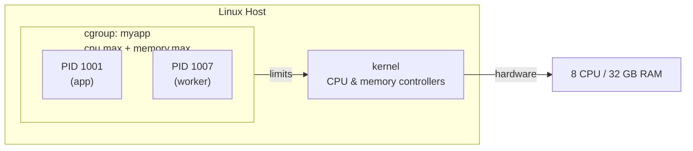
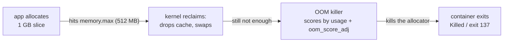

Containers are easy to describe and surprisingly hard to explain. You run a
container, and it behaves like a small Linux computer. It has its own process
tree, its own network, its own filesystem. And yet - and this is the part that
confuses everyone the first time - it is not a virtual machine. There is no
second operating system hiding inside.

So what actually makes a container a container?

The honest answer has two halves. The first half is **namespaces**, which give
the container its own *view* of the world - its own process IDs, its own
network interfaces, its own mount points. The second half is **cgroups**, which
give the container its own *budget* - a fixed share of the CPU, a ceiling on
memory, a limit on the processes it can spawn.

This post is the story of the second half. We build cgroups from the ground
up - what problem they solve, how the kernel implements them, and how a single
line like `docker run --memory 512m` or a Kubernetes `resources.limits` entry
turns into real, enforced limits on a shared machine.

## The problem: one big pile of resources

Imagine you rent a server with 8 CPUs and 32 GB of RAM. You want to run ten
different services on it. Some are busy, some are quiet. Some are buggy, some
are well behaved.

If there were no limits, any single service could wreck the machine for
everyone else. A memory leak in one process slowly eats 20 GB, then the
kernel's out-of-memory killer starts shooting processes - and it might shoot
*yours*, the important one. A runaway loop pegs one CPU core at 100% and the
service that needed that core becomes slow.

What you want is a way to say: *this group of processes may use at most 1 CPU
core, and at most 4 GB of memory.* If it exceeds that, slow it down or kill
it - but leave everyone else alone.

That is precisely what cgroups do.

> Keep this sentence: **cgroups let you divide a machine's resources among
> groups of processes, and enforce the boundaries.**

## What does the name mean?

cgroup stands for **control group**. It is a Linux kernel feature - present
since kernel 2.6.24 in 2008 - that groups processes together and lets you put
limits on the group as a whole.

There is an important nuance in that word *group*. You do not limit a single
process. You create a group, put processes into it, and the limit applies to
everything in the group combined. A container is really just a group: the
kernel puts every process of the container into one cgroup and applies limits
to that group.

The second-generation implementation is called **cgroups v2**. It first
appeared in kernel 4.5 (2016) and is now what modern distributions and
container runtimes use. We use v2 throughout, and I flag the few places where
the older v1 behaved differently.

## The mental model: a hierarchy of boxes

Think of the machine's resources as a single box. You can divide that box into
smaller boxes, and divide those again. Each box is a cgroup, and the boxes
nest in a strict hierarchy.

```
Machine (8 CPU, 32 GB RAM)
|
+-- system.slice          (the host's own services)
|
+-- user.slice            (your login session)
|
+-- docker/
    |
    +-- container-a        (my app, limit: 1 CPU, 4 GB)
    +-- container-b        (the database, limit: 2 CPU, 8 GB)
```

Each cgroup has a parent (the top is the root cgroup, which is the whole
machine). Limits you set on a cgroup apply to it *and* everything beneath it.
The kernel enforces these as you move down the tree.

## How you actually see a cgroup

cgroups are exposed as files. On a modern Linux box, the filesystem at
`/sys/fs/cgroup/` is a virtual view of the cgroup tree. Each directory is a
cgroup. Each file inside it is a control or a measurement.

Let us look at a real one. On any Linux machine you can do:

```bash
$ cat /sys/fs/cgroup/cgroup.controllers
cpuset cpu io memory hugetlb pids
```

That tells you which resource controllers this host supports - CPU, IO,
memory, process counts, and more. Each controller is a resource you can limit.

Now create a cgroup and put a process into it. This is a v2 lab example - it
needs root, and on a systemd-based host you would normally create slices via
`systemd-run` rather than touch the tree by hand:

```bash
# 1. Create a new cgroup called 'myapp' (needs root)
$ sudo mkdir /sys/fs/cgroup/myapp

# 2. Enable the controllers you want to use in the parent subtree first
$ echo "+cpu +memory +pids" | sudo tee /sys/fs/cgroup/cgroup.subtree_control

# 3. Give it a memory limit of 100 MB
$ echo 104857600 | sudo tee /sys/fs/cgroup/myapp/memory.max

# 4. Put our shell (and its children) into the group
$ echo $$ | sudo tee /sys/fs/cgroup/myapp/cgroup.procs
```

A v2 detail is hidden in step 2: a controller is only usable in a child cgroup
if the parent has first enabled it in its `cgroup.subtree_control` file. Skip
that step and `memory.max` will not exist inside `myapp`. (The plain
`echo > file` in steps 3-4 would also fail without root - the writes need to
go through `sudo tee`.)

That is the whole magic. You just created a memory cap, and the kernel will
now enforce it on everything in `myapp`. If processes in the group try to use
more than 100 MB, they get slowed down, and if they keep going, they get
killed. No daemon, no magic - just the kernel reading a number out of a file.

## The CPU controller: shares and caps

The most intuitive-sounding limit - CPU - is also the one that trips people
up, because the controller gives you two different knobs and they work
completely differently. Confusing them is the single most common cgroups
mistake.

CPU time is not a thing you can bank. The kernel cannot give a process "half
a second and hold the rest". It schedules processes onto cores thousands of
times a second, and the only meaningful question is: *when two processes both
want the CPU, who gets it?*

The first knob is **shares** (`cpu.weight`) - relative weights, not absolute
amounts:

```text
container-a   cpu.weight = 100
container-b   cpu.weight = 200
```

If both containers are running flat out, the kernel divides CPU time in
proportion to the weights. Container-b gets twice as much as container-a:
about 66% vs 33%. If container-b goes quiet, container-a can use the whole
machine - shares are a *floor you are guaranteed*, not a *cap you cannot
exceed*.

This is the single most common confusion. People write `cpu.weight` and expect
"this container may use at most X%". That is not what shares mean. Shares say
"when the machine is busy, this container is entitled to this fraction". A
quiet neighbor does not mean you get to keep their share - it means the CPU is
free for anyone.

If you genuinely want a hard cap - "this container may never use more than 1.5
cores, no matter what" - you use the `cpu.max` file, which is a quota over a
period:

```text
/sys/fs/cgroup/myapp/cpu.max  →  150000 100000
```

That means: this group may use at most 150,000 microseconds of CPU per 100,000
microsecond period - i.e. one and a half cores, hard. It gets throttled the
moment it hits that wall.

> The two files answer two different questions. `cpu.weight` = *share when
> busy*. `cpu.max` = *hard ceiling, always*.

## The memory controller: a ceiling you cannot pass

Memory is different from CPU because it is not divisible in time - it is a
finite pool. A process either has a page of RAM or it does not. So the memory
controller enforces a **hard limit** with none of the share ambiguity of the
CPU.

```text
/sys/fs/cgroup/myapp/memory.max  →  1073741824   (1 GB, in bytes)
```

The kernel watches how much memory the group has been charged with - and that
is more than just the anonymous heap and stack. **Page cache** and kernel
memory count toward the limit too. When the group approaches the ceiling, the
kernel starts reclaiming: it **drops clean page cache** immediately (there is
nothing to push to disk - the pages are already on disk), and writes dirty
pages back first. When there is nothing left to reclaim, it has one final
tool - the **OOM killer**.

The OOM killer is the hammer. When a cgroup hits its memory ceiling and cannot
free anything else, the kernel picks a process inside the group and kills it.
It scores candidates by how much memory they are using, adjusted by each
process's `oom_score_adj` (a bias you can set from userspace) - the bigger the
charge, the more likely the kill. This is why you see your container's process
get `Killed` with no error message - the kernel chose it to relieve the
pressure.

There is a much-loved escape hatch: the `memory.oom.group` file. With it set,
the kernel kills *the whole group* instead of picking one victim, so a
runaway container dies as a unit rather than limping along half-dead. Note
that cgroups only do the killing - the restart that follows is your
orchestrator's job, which sees the container exit and recreates it.

```text
echo 1 > /sys/fs/cgroup/myapp/memory.oom.group
```

## The pids controller: runaway process limits

One more controller is worth knowing because it stops a whole class of
accidents: **pids**. It limits how many processes a cgroup can create.

Without it, a buggy container that forks forever can exhaust the host's entire
process table (the kernel's `PID_MAX`), which begins to break the machine for
*everyone* - not just the container. The pids controller draws a line:

```text
/sys/fs/cgroup/myapp/pids.max  →  1024
```

Now that cgroup cannot spawn more than 1024 simultaneous processes. When a new
`fork()` would exceed it, the kernel simply refuses - the process gets `Resource
temporarily unavailable` instead of the host running out of PIDs. The counter
includes **threads** too: a cgroup at its pids limit cannot create a new thread
either, so thread-spamming workloads hit the same wall.

One Kubernetes clarification: there is no per-Pod PID limit in the Pod spec.
The limit is set on the **kubelet** - `podPidsLimit` in the kubelet config, or
`--pod-max-pids` as a flag - and the kubelet writes it into each pod's cgroup.
Leaky workloads get contained that way instead of collapsing the node.

## Putting it together: what Docker actually does

Every container you have ever run is a cgroup with a few files written into
it. When you run:

```bash
docker run --cpus 1.5 --memory 512m myapp
```

Docker (via `runc`) creates a cgroup and writes the equivalent of:

```text
cpu.max        = 150000 100000     # 1.5 cores hard cap
memory.max     = 536870912         # 512 MB ceiling
```

It then puts every process of the container into that cgroup. The kernel does
the rest. There is no container daemon sitting in the data path - a group of
processes with numbers attached to it. That is the entire secret.



## How Kubernetes maps to cgroups

Kubernetes sits one layer up. When you write a Pod spec with:

```yaml
resources:
  requests:
    cpu: "250m"      # 250 milli-cpu
    memory: "256Mi"
  limits:
    cpu: "1"
    memory: "512Mi"
```

The **kubelet** on the node translates those into cgroup files for the pod's
cgroup. Here is the mapping:

| Kubernetes field | cgroup file | Effect |
|---|---|---|
| `requests.cpu` | `cpu.weight` | share of CPU when node is busy |
| `limits.cpu` | `cpu.max` | hard ceiling, throttled |
| `requests.memory` | `memory.low` (best effort) | may be protected from reclaim; runtime-dependent |
| `limits.memory` | `memory.max` | hard ceiling, OOM-kill trigger |

The subtle point - and the one that trips up production teams - is that
Kubernetes **requests** and **limits** are different kinds of things. Requests
are a *weight*: for CPU that maps to `cpu.weight`, a guaranteed share when the
node is busy. For memory it is looser - the docs say the runtime *may* protect
request-guaranteed memory via `memory.low`, but that is best effort and
depends on the runtime, not a hard guarantee. Limits are a *hard ceiling*
(the `cpu.max` and `memory.max` family): they cap and throttle. A pod with no
limit can burst to the whole node. A pod with a memory limit is not cut off at
an instant wall - the kernel first reclaims (dropping page cache, swapping),
and only OOM-kills when nothing else can be freed.

That is why a container that "is using more memory than its limit" does not
fail - it gets *throttled* or *OOM-killed*, depending on which resource and
which file governs.

## A worked example: the runaway process

Let us watch the whole thing happen with a concrete example, because this is
where the theory stops being abstract.

You run a container with a 512 MB memory limit. Inside, a Go program
allocates a 1 GB slice and writes to it in a loop - a genuine bug, the kind a
leftover debug flag or an unbounded cache produces. The writing matters:
allocating alone only reserves virtual address space, and the kernel only
charges pages to the cgroup once the program actually touches them.

1. The program allocates and writes to the slice; each touched page is
   charged to the cgroup.
2. The cgroup's `memory.current` climbs toward `memory.max` (512 MB).
3. As it approaches, the kernel reclaims: it drops the container's page cache,
   swaps out what it can.
4. There is nothing left to reclaim, but the program asks for more.
5. The kernel invokes the OOM killer, scores the processes in the cgroup, and
   kills the big allocator.
6. The container's main process dies. If `memory.oom.group` is set, the whole
   container dies at once.



Your log shows `Killed` or exit code 137 (128 + 9, SIGKILL). No friendly
error, no stack trace - just the kernel's arithmetic deciding one process was
the right sacrifice to keep the rest of the machine alive. One caution:
137 means the process died from SIGKILL, which is what the OOM killer sends -
but SIGKILL also arrives from `kill -9`, a runtime shutdown, or a probe. Exit
137 alone is not proof of OOM; check `dmesg` for the kernel's OOM message if
you need certainty.

## The one mental model to keep

Strip away the files and the controllers and there is a single idea:

> A cgroup is a **named group of processes with attached limits**. The kernel
> enforces the limits against the whole group, not the individuals.

Every resource controller is a different way of answering "what happens when
this group asks for more than it should have?" The CPU controller throttles
and shares. The memory controller reclaims, then OOM-kills. The pids
controller refuses the `fork()`.

Containers are the product of this machinery. Namespaces give a container its
identity - its own view of the world. Cgroups give it its boundaries - its own
budget of CPU, memory, and processes. When someone says a container is "just a
process with a view", the *view* is namespaces and the *budget* is cgroups.

Now, when you write `resources.limits` in a Deployment or see a container die
with `Killed`, you know exactly what the kernel did: it read a number out of a
file, and then it held a group of processes to that number. No mystery left.