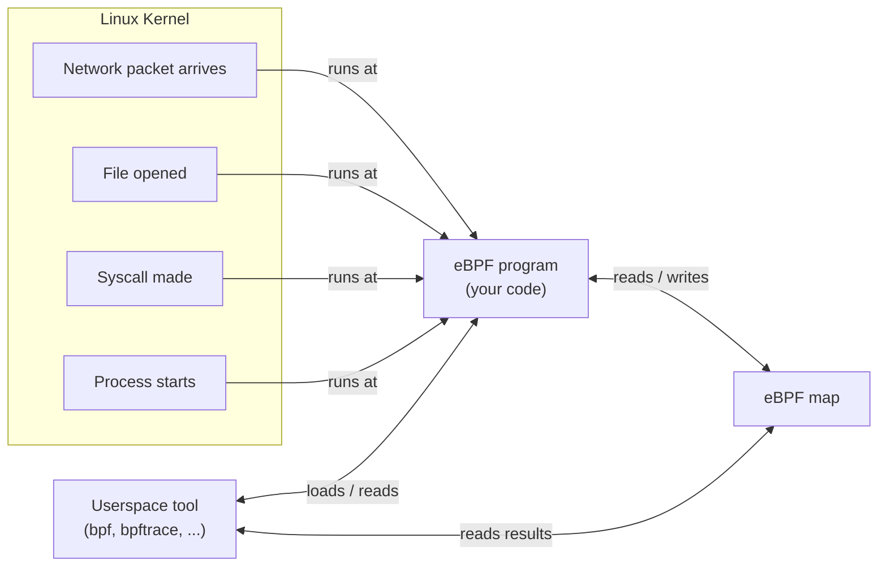
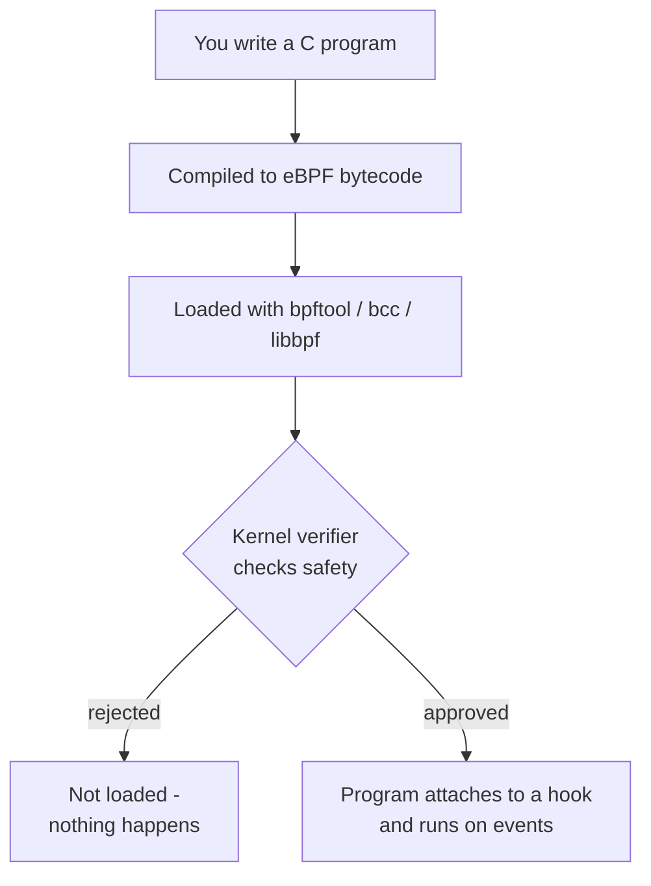
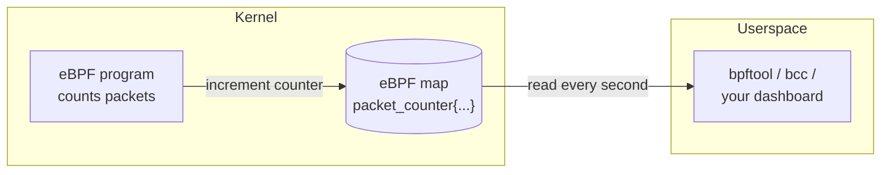
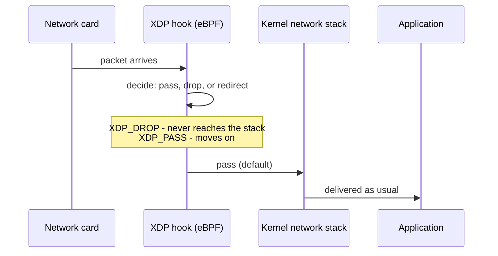

Every few years Linux gets a feature that feels like a magic trick. You hear
about it everywhere, you nod along, and then you quietly admit to yourself:
I do not actually know what it does.

eBPF is one of those. It is the reason Cilium can replace a load balancer, the
reason Falco can watch every syscall a container makes, and the reason modern
observability tools can see inside your process with almost no overhead. But
it is also a deeply confusing topic, because it sits at the boundary of
userland and kernel, tooling and C, maps and programs.

This post takes the long way in. We start with the one mental model that makes
everything else click, build up the pieces one at a time, and use simple
diagrams throughout. No prior kernel experience needed.

## The one idea to keep in your head

The Linux kernel is a program that decides who gets the CPU, the memory, the
disk and the network. It is huge, trusted, and written mostly in C. For
decades, the only way to change what it does was to modify the kernel source
and reboot - or write a kernel module and hope you got it right.

A kernel module runs with full privileges. If it crashes, the whole machine
crashes. There is no safety net. This is why running third-party code inside
the kernel has always felt a little reckless.

eBPF (extended Berkeley Packet Filter) is the answer to that problem. It lets
you load a small, checked program into the kernel - and run it safely, without
rebooting and without risking the machine.

> Keep this sentence: **eBPF is a safe sandbox for running code inside the
> Linux kernel.** Everything else is detail.

## The three things every eBPF program needs

Every eBPF program you will ever see is built from three pieces. Hold onto
these and the rest is easy:

1. **A program** - the logic that runs when an event happens.
2. **A hook point** - the place in the kernel where the program runs.
3. **A map** - a small data store the program can read and write.

Let us look at each one.

## Hook points: where programs attach

The kernel is full of events. A network packet arrives. A file is opened. A
system call happens. A process starts. Each of these is a place eBPF can
attach.

The key word is *event-driven*. Your eBPF program does not run all the time. It
runs when a specific event happens at a specific spot in the kernel. That spot
is the **hook point** (the kernel calls it an *attach point*).



Some common hook points you will hear about:

- **`kprobes`** and **`kretprobes`** - run before or after a kernel function.
- **`tracepoints`** - stable, documented points the kernel team maintains.
- **`XDP`** - runs the moment a packet hits the network interface, before most
  of the networking stack.
- **`TC`** - the traffic control layer, after the packet has been classified.
- **`uprobes`** - attach to a function in a userspace program, not the kernel.

> A jargon dictionary: **kprobe** is "kernel probe" - a safe way to watch a
> kernel function. **XDP** is "eXpress Data Path" - the fastest place to see a
> packet. **TC** is the traffic-control subsystem, the same one `tc` configures.

## The program: small, checked, and safe

Your eBPF program is written in C, but it is compiled into a special format
that the kernel can verify. That verification step is what makes eBPF safe.

The kernel runs a **verifier** over your program before it will let it run.
The verifier checks, among other things, that your program:

- Always terminates (no infinite loops).
- Never writes to arbitrary memory.
- Can only access kernel memory through approved helper functions.
- Never crashes or corrupts the kernel.

This is the crucial difference from a kernel module. A kernel module is
trusted by default. An eBPF program has to *prove* it is safe first.



A **jargon note**: the "bytecode" is the compiled form of your program - think
of it as the machine code for the eBPF virtual machine, the small sandbox the
kernel runs inside. The **verifier** is the security guard that checks your
program before it enters.

## Maps: the memory eBPF can touch

An eBPF program cannot just reach into the kernel and read anything. It can
only touch kernel memory through two doors:

1. **Helper functions** - safe, approved kernel functions your program can call.
2. **Maps** - its own little data structures.

A **map** is a key-value store that lives in the kernel. The eBPF program
writes to it. A userspace tool reads from it. This is how data gets out of the
kernel and into your observability dashboard.



This is the pattern behind almost every eBPF observability tool: the eBPF
program records events into a map, and a userspace process periodically reads
the map and renders a dashboard or graph.

## A concrete example: counting TCP connections

Let us make this real. The classic eBPF hello-world counts TCP connections on
a machine. Here is the whole program, and we will read it line by line.

```c
#include <linux/bpf.h>
#include <bpf/bpf_helpers.h>

// A map named "counts" that stores a 64-bit number per key.
struct {
    __uint(type, BPF_MAP_TYPE_HASH);
    __uint(max_entries, 1024);
    __type(key, __u32);
    __type(value, __u64);
} counts SEC(".maps");

// Runs on every TCP connect - the kprobe hook.
SEC("kprobe/tcp_connect")
int on_connect(struct pt_regs *ctx)
{
    __u32 pid = bpf_get_current_pid_tgid() >> 32;
    __u64 *value = bpf_map_lookup_elem(&counts, &pid);
    if (value) {
        *value += 1;
    } else {
        __u64 one = 1;
        bpf_map_update_elem(&counts, &pid, &one, BPF_ANY);
    }
    return 0;
}

// Declares this program as the program to run.
char _license[] SEC("license") = "GPL";
```

What each piece does:

- **`BPF_MAP_TYPE_HASH`** - the map is a hash table. Keyed by PID, it stores a
  count. Jargon: a hash table is a data structure that maps a key to a value
  quickly, like a dictionary.
- **`SEC("kprobe/tcp_connect")`** - says "attach me to the `tcp_connect`
  kernel function." Every time a TCP connection is made, this runs. **`SEC`**
  is a macro, shorthand for "section," a labelled part of the compiled program.
- **`bpf_get_current_pid_tgid() >> 32`** - gets the PID of the process that
  triggered the event. The `>> 32` shifts the bits to extract just the PID
  from a combined value. Jargon: a **PID** is the process ID, the kernel's name
  for a running program.
- **`bpf_map_lookup_elem`** and **`bpf_map_update_elem`** - the helpers that
  read from and write to the map. Jargon: a **map** is the eBPF data store -
  a key-value structure, like a dictionary.
- **`bpf_get_current_pid_tgid`** is a helper function - one of the safe
  kernel doors. Jargon: **helper** functions are the only kernel functions an
  eBPF program is allowed to call.

Once loaded, every TCP connection increments a counter for the process
that made it. A userspace tool reads the map and shows you which processes are
the most chatty on the network.

## XDP: the fastest path in the kernel

The most famous eBPF use case is **XDP** - running a program at the absolute
earliest point a packet is seen. This is how Cilium and Cloudflare drop or
forward packets at line rate, before the kernel's main networking stack even
gets involved.

Why does this matter? Because the closer to the hardware a packet is handled,
the less work the kernel does, and the faster it goes. XDP attaches at the
network driver level - the very first place a packet exists.



The three things XDP can do to a packet are called **actions**:

- **`XDP_DROP`** - throw the packet away. Great for blocking DDoS traffic.
- **`XDP_PASS`** - hand it to the normal stack.
- **`XDP_REDIRECT`** - send it to another interface or queue.

> Jargon: **line rate** means the interface is processing packets as fast as
> the hardware can physically move them. If you can handle packets in XDP,
> you are not the bottleneck.

## Why eBPF became a big deal

Three things happened in the last few years that turned eBPF from a niche
trick into infrastructure:

1. **Cilium and the CNI wave** - Cilium builds its networking and security on
   eBPF. It replaced the kernel's `iptables`/`kube-proxy` path with eBPF
   programs, which is faster and can see connection state more easily.
   Jargon: **CNI** is the Container Network Interface, the standard Kubernetes
   uses to plug networking in.
2. **Falco and runtime security** - Falco attaches eBPF probes to syscalls and
   alerts when a container does something suspicious, like spawning a shell or
   reading `/etc/shadow`.
3. **Observability without agents** - tools like `bpftrace` and the
   bcc toolkit let you trace what the kernel and your apps are doing with
   near-zero overhead, without installing an agent into every container.

The pattern that connects all of them: **move policy and logic closer to where
the data happens** - into the kernel - instead of watching from far away in
userspace.

## The tools you will actually use

You rarely write raw eBPF C. Real work happens through tooling that wraps it.

| Tool | What it does | When you use it |
| --- | --- | --- |
| `bcc` / `libbpf` | Write eBPF in C, load it, with bindings in Python and more | Serious custom programs and tracing |
| `bpftrace` | A one-line scripting language for tracing | Quick "what is happening right now" questions |
| `bpftool` | Inspect, load and manage eBPF programs and maps | Debugging and low-level management |
| `cilium` | Networking + security built entirely on eBPF | Kubernetes networking and policy |

A good first command on any Linux box (as root) is:

```shell
bpftool prog list
```

It shows every eBPF program currently loaded on your machine. If you run
Kubernetes with Cilium, the list will be long.

## A mental model to take away

When in doubt, think of eBPF like this:

- **The hook** is the event - a packet, a syscall, a function call.
- **The program** is a tiny, verified function that runs when the event fires.
- **The map** is the notepad where the program writes, and your userspace tool
  reads.

The kernel verifies your program is safe before it ever runs, so you get the
power of running code inside the kernel without the risk of crashing the
machine. That safety is the entire reason eBPF took over the world of
networking and observability.

If you remember one thing: **eBPF lets application developers write kernel
code safely.** That single sentence unlocks every article you will read about
Cilium, Falco, or kernel tracing from here on.