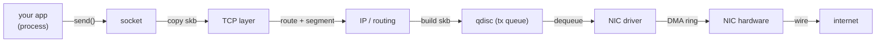
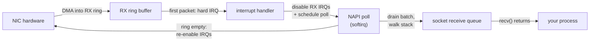

Every developer has sent data over a network. Very few can say what happened
between the moment their process called `write()` and the moment bytes
appeared on the other side of the world. There is a kernel-sized black box in
between, and it does a surprising amount of work.

This post opens that box. We follow a single packet through the Linux network
stack - from a userspace socket, down into the kernel, across the NIC and out
onto the wire, and then the same journey in reverse for the reply. We keep it
concrete: real queues, real kernel subsystems, real reasons each step exists.

No kernel experience needed. If you have run `ping`, seen a `tcpdump` output,
or wondered why your load balancer needs multiple cores to keep up - this is
the post for you.

## The one idea to keep in your head

The network stack is a set of **queues** with **workers** on both sides.
Packets do not teleport. They sit in a queue, wait for a worker to pick them
up, get processed, and move to the next queue.

At every boundary there is the same shape: something produces packets into a
queue, something consumes them, and if the producer is faster than the
consumer, the queue grows and packets wait (or get dropped). The whole art of
network performance is keeping those queues short.

> Keep this sentence: **a network packet is a job that moves through a
> pipeline of queues, and each step either processes it or queues it.**

## The journey, mapped out

Here is the full route a packet takes outbound, before we walk each leg:



That is the outbound path. Each arrow is a real step where a queue or a data
structure changes hands. We now walk each one.

## The socket: your process's door to the kernel

It all starts with a **socket**. A socket is a file descriptor - a number your
process can `read()` and `write()` to - that the kernel has wired up to a
network connection instead of a file on disk.

When your app calls `send(fd, data, len, 0)`, here is what happens in the
kernel:

1. The kernel looks up the file descriptor and finds the socket structure.
2. It allocates an **skb** - a `struct sk_buff`, the kernel's name for a
   network packet. This is the fundamental unit of network I/O in Linux.
3. It copies your userspace `data` into the skb's data area.
4. It hands the skb to the protocol layer - TCP for a TCP socket.

The socket layer is your process's only window into the network. Everything
after this point happens in kernel context, on behalf of your process, but
outside your process's address space.

## The TCP layer: segmentation, windows and the state machine

If your socket is a TCP socket (nearly all web traffic is), the next stop is
the TCP layer. This is where the famous TCP behavior lives.

The key concept is the **MTU** (Maximum Transmission Unit) - the largest
packet the link can carry, usually 1500 bytes on Ethernet. Your app may call
`send()` with 64 KB of data, but the kernel cannot put 64 KB in one Ethernet
frame. So the TCP layer **segments** the data into chunks that fit. On a plain
IPv4 connection over a 1500-byte MTU link with no TCP options, that is 1460
bytes of payload per packet:

```text
your 64 KB write()  →  ~44 packets of ~1460 bytes each
```

One nuance: segmentation offload moves the splitting later in the path. **TSO**
(TCP segmentation offload) lets a NIC that supports it do the TCP segmentation
in hardware from one large buffer, and **GSO** (generic segmentation offload)
does the same split in software, in the driver or stack, when the NIC has no
TSO. Either way the *wire packets still fit the MTU* - the offload just saves
CPU by not doing the split up in the TCP layer.

Each segment gets a sequence number, a destination port, a window size, and
gets queued for transmission. The sender's **congestion window** - how much
in-flight data it allows itself - grows as acknowledgements come back (that is
the slow start / congestion avoidance dance), and it shrinks on **congestion
signals**: packet loss or explicit congestion notification (ECN). Loss and ECN
are the big ones, but an idle interval can also let it drop, and delayed ACKs
by themselves do not necessarily reduce it. All of this happens invisibly,
inside the kernel.

The kernel does one more thing here: it attaches a **socket buffer** (`skb`)
with all the TCP headers filled in, ready for the next layer. It then asks the
routing layer: *which interface does this destination use, and what is the
next hop?*

## The IP and routing layer: picking the exit

The routing layer answers the "which way out" question. It looks up the
destination IP in the **routing table** (`ip route`) and decides:

- which **interface** the packet leaves through (`eth0`, `eth1`, ...)
- which **gateway** receives it next, if the destination is not local
- what **source address** to use

This is also where the kernel may apply **iptables / nftables** rules in the
`OUTPUT` and `POSTROUTING` chains - the layer where NAT masquerading and
firewall policy live. The skb is now fully addressed and leaves the routing
layer, heading for the transmit queue.

## The qdisc: the queue that shapes your traffic

Before a packet can reach the NIC driver, it sits in a **qdisc** (queueing
discipline). This is a userspace-visible, tunable queue - you have seen it
with `tc` (traffic control).

The qdisc is where the kernel does its shaping: `tc` can attach anything from
a simple FIFO to `htb` (classful rate limiting) or `fq_codel` (fair queuing
with controlled delay). The default varies by distro and kernel - older setups
use `pfifo_fast`, many modern ones ship `fq_codel` - so check yours with
`tc qdisc show`. This is the queue that determines a packet's **latency**
under load - the one that makes `ping` spike when the link is saturated.

The qdisc hands packets to the NIC driver one at a time, when the driver says
it can accept more.

## The NIC driver and the ring buffer

Now we are at the bottom. A NIC has one or more **TX and RX queues** - the
queue count is set by the NIC itself and its driver, and you inspect and
sometimes change it with `ethtool -L` - and each queue is backed by a **DMA
ring**: a ring of descriptors pointing at kernel memory where the packet data
lives.

The driver allocates a set of **descriptors** (small structures pointing at
kernel memory where the packet data lives) and hands them to the NIC. The NIC
uses **DMA** (Direct Memory Access) to read the packet data straight out of
RAM and onto the wire - the CPU does not copy the bytes one at a time. The
hardware does the copy in parallel while the CPU does other work.

This is the key to high-performance networking: the CPU sets up the descriptor,
the hardware does the bulk copy, and the CPU only hears about it when the
packet is gone. NICs also **coalesce** completions - they batch many finished
packets into one interrupt instead of interrupting per packet (`ethtool -c`
tunes this).

```text
CPU    →  builds skb, fills descriptor, tells NIC "go"
NIC    →  DMA-reads bytes out of RAM onto the wire
NIC    →  interrupts CPU "done"
```

## The receive path: the same story, reversed

Now the reply comes back. The receive path is the mirror image, with one
important difference: the CPU gets interrupted a lot more.

1. The NIC receives bytes and **DMA-writes** them into the RX ring buffer -
   kernel memory it has been told about in advance.
2. The first packet of a burst raises a **hard IRQ**. The kernel's interrupt
   handler does the minimum - it acknowledges the hardware and schedules a
   **softirq**.
3. The **softirq** (deferred kernel work that runs outside hard-interrupt
   context, on a CPU core) pulls packets out of the RX ring.
4. The softirq walks each packet up: IP reassembly, TCP delivery, and finally
   waking your process by putting the data into the socket's receive queue.
5. Your process's `recv()` returns with the data.

The receive path is why people say network performance is about **interrupt
mitigation**. The trick modern drivers use is **NAPI** (New API). On the first
packet, the interrupt handler does not just schedule work - it also **disables
that queue's RX interrupts**. A poll loop then drains a whole batch of packets
from the ring with interrupts still masked, and only when the ring is empty
does the driver **re-enable interrupts** and go quiet again. The result: under
load you take far fewer interrupts, and each one buys you many packets.



## Why this matters: three practical lessons

Here is where the theory pays rent, with three real situations you will meet.

### Lesson 1: Why one core gets saturated

Because softirqs process packets, and softirqs run on a CPU core, a high
packet rate can pin one core at 100% handling interrupts - while the other
cores sit idle. This is the classic "one core on fire" load balancer problem.
The fix is to spread work across cores: **RSS** (Receive Side Scaling) splits
incoming flows across the NIC's RX queues, **RPS** (Receive Packet Steering)
does the spreading in software on queues the NIC does not provide, and setting
**IRQ affinity** pins each queue's interrupt to a specific core so the work and
the interrupt land on the same CPU.

### Lesson 2: Why tuning the NIC ring matters

The RX ring has a finite size, and when it overflows the NIC starts dropping
packets. But do not conclude "ring overflow" from `rx_dropped` alone - that
generic counter also counts drops for other reasons. Check the NIC-specific
counters in `ethtool -S` first (`rx_missed_errors`, `rx_fifo_errors`,
`rx_no_buffer_count`). If the ring really is the bottleneck, raising its size
(`ethtool -G eth0 rx 4096`) gives the kernel more headroom. That helps with
**bursts** - a spike that briefly outruns the CPU - but it is not a fix for
sustained overload: if the softirq cannot keep up on average, no ring size
saves you; you need more cores, RPS, or less traffic.

### Lesson 3: Why `tc` and qdiscs add latency

Every qdisc is a queue, and queues add delay. A plain FIFO queue holds
packets in strict arrival order, so a burst of bulk transfers queues a small
interactive packet behind them - that is your `ping` spike. `fq_codel` attacks
that from two directions at once: the **fq** (fair queuing) half gives each
flow its own queue so one bulk flow cannot crowd everyone else, and the
**CoDel** (controlled delay) half drops or marks packets when a queue stays
full for too long, which keeps latency bounded. It does not "prioritize small
packets" - it keeps each flow fair and each queue short, and that is what
protects interactive traffic.

## The one mental model to keep

Put it all together and the stack is simple:

> A packet is a **job** that moves through a **pipeline of queues**. Your
> socket produces it, the kernel's protocol layers process it, the qdisc
> queues it, the NIC's DMA ring carries it onto the wire - and on the way back,
> interrupts and softirqs feed it up to your socket.

Each leg is a place where work happens, where queues can grow, and where you
have a tuning knob. The stack is not a magic black box; it is a set of
well-named queues with well-understood behavior.

Now, when you see `rx_dropped` climb or one core peg out under traffic, you
know which queues and counters to investigate before choosing a tuning knob -
not a single answer, but a map of where to look. That is the whole point of
understanding the stack - not to memorize layers, but to know where the work
actually happens.