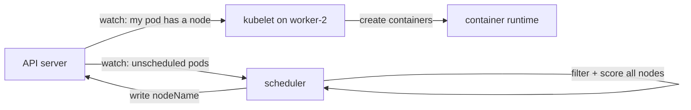
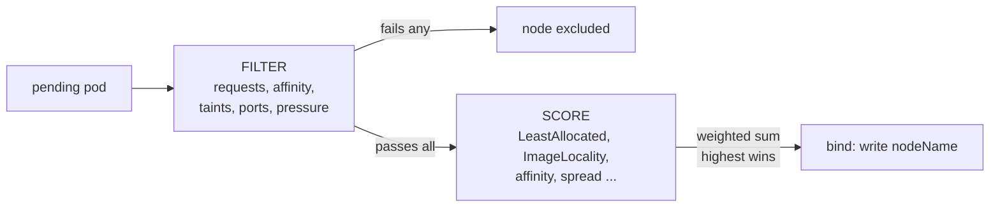

There is a moment everyone meets Kubernetes for the first time. You write a
Deployment, run `kubectl apply`, and within seconds your pods appear on nodes.
You never told Kubernetes which node to use. It just... knew.

The component that decides is the **scheduler**, and it is one of the least
understood parts of the control plane - partly because it works so well that
you never need to look at it, and partly because people assume it involves
some kind of clever optimization.

It does not. The scheduler is a two-step pipeline that runs thousands of times
a second: **filter** out nodes that cannot host the pod, then **score** the
ones that remain and pick the best. That is the whole design. This post builds
that pipeline from scratch - the scheduling loop, the hard constraints, the
soft preferences, and the features that hang off it (affinity, taints,
topology spread).

No control-plane experience needed. If you have ever wondered "why did my pod
land *there*?" - this is the post for you.

## The one idea to keep in your head

A scheduler is not an optimizer that finds the perfect placement. It is a
**filtering and ranking function** that runs fast and picks a *good enough*
node. Kubernetes deliberately does not try to find the global optimum -
clusters are too big and too dynamic for that. It finds a node that works and
that scores well, and it moves on.

> Keep this sentence: **scheduling = filter out the impossible, then score
> the possible and take the best.**

## The scheduling loop: a never-ending watch

Before we get to the algorithm, we need to know when it runs. The scheduler is
a **control loop** - it watches the API server continuously:

1. The scheduler watches for **unscheduled pods** - pods whose
   `spec.nodeName` is empty.
2. When one appears, it runs the filter/score pipeline against every node in
   the cluster.
3. It writes the winner back to the API server: `spec.nodeName = worker-2`.
4. The kubelet on `worker-2` sees the assignment, talks to the container
   runtime, and starts the pod's containers.

That fourth step matters for an important detail: **the scheduler only decides
the node**. It does not start containers. The kubelet does. The scheduler is
an API-server client that writes one field (`nodeName`), and the kubelet is
the agent that reacts to it.



## The scheduling cycle, in code

The scheduler's main loop runs a tight cycle for each pod. In pseudocode it is
a few lines:

```text
for each pending pod:
    nodes = list all nodes in the cluster
    feasible = [n for n in nodes if passes(n, pod)]     # FILTER
    if not feasible:
        mark pod unschedulable, wait and retry
    else:
        winner = argmax(feasible, key=n -> score(n, pod))  # SCORE
        bind(winner, pod)                                # write nodeName
```

That is the entire algorithm. Everything else in the scheduler is detail about
what `passes()` and `score()` actually check. Let us look at each.



## Filtering: the hard constraints

The filter phase answers one question, strictly: *can this node host this pod
at all?* A node that fails any filter is out, no second chances. The big ones:

**1. Resource requests.** The node must have enough free CPU and memory for
the pod's `requests`. The scheduler reads each node's **allocatable**
resources (capacity minus system overhead) and subtracts the requests of every
pod already there. If the remaining is less than what the new pod asks for,
the node is filtered out.

```text
node capacity:       8 CPU, 16 GB
already requested:   5 CPU, 11 GB
free:                3 CPU,  5 GB
new pod requests:    2 CPU,  4 GB   →  fits, passes the filter
new pod requests:    4 CPU,  6 GB   →  does not fit, filtered out
```

Note that it is `requests`, not `limits`, that count here. A pod with a huge
limit but a tiny request fits on a node with tiny headroom - which is exactly
why bursty pods surprise people ("its limit is 8 CPU but it landed on a node
with 1 CPU free!").

**2. Node selector and affinity.** `nodeSelector` and `nodeAffinity` say "this
pod must go to a node with these labels" (GPU nodes, region labels, storage
labels). A node without the required labels fails the filter.

**3. Taints and tolerations.** Taints are the inverse: a node can be *marked*
("this node is for GPU workloads only" via `node-role.kubernetes.io/gpu:NoSchedule`)
and only pods that **tolerate** the taint may land there. A pod without the
matching toleration is filtered out.

**4. Port conflicts.** If two pods want to bind the same host port on the
same node (`hostPort: 8080`), the second one is filtered out - the node cannot
serve both.

**5. Disk pressure, memory pressure, PID pressure.** The scheduler also
listens to node health signals. A node reporting pressure is filtered out for
new work until it recovers.

These are the hard walls. A node that clears all of them enters the scoring
phase.

## Scoring: the soft preferences

Now the scheduler has a list of *feasible* nodes, and it must pick one. This
is where the competition happens. Each node is scored 0-100 by a set of
**scoring plugins**, and the node with the highest total wins.

The default resource scorer is **NodeResourcesFit**, and its default strategy
is **LeastAllocated**: it prefers the node with the most free resources, so
pods spread out rather than pile onto one node:

```text
node A: 90% allocated → score low
node B: 30% allocated → score high
```

The strategy is configurable. **MostAllocated** is the opposite - it
bin-packs pods onto as few nodes as possible (useful when you want to keep
nodes consolidated or shut idle ones down) - and **RequestedToCapacityRatio**
lets you define a custom scoring curve. None of these dominates by default,
though: every enabled scoring plugin contributes, and a node's final score is
the **weighted sum of all plugins** - each normalized to 0-100, multiplied by
its configured weight. LeastAllocated is one vote in that sum, not the whole
election.

Other scorers add nuance. **ImageLocality** prefers a node that already has
the pod's image pulled (saves download time). **NodeAffinity** scoring gives a
slight bonus if the pod *prefers* (not requires) a node. **Spread** plugins
try to place replicas of the same workload across different nodes or zones.

The final choice is the argmax: highest total score wins. Ties are broken
randomly, which is why two identical pods of the same Deployment can land on
different nodes - their candidate sets scored the same, and the winner was
picked at random from the equal-scoring set.

## The three scheduling features that build on this

Everything you have heard about - affinity, taints, spread - is just a
different way of expressing a filter or a score.

### Node affinity: required vs preferred

`nodeAffinity` has two halves that map exactly onto the two phases:

```yaml
spec:
  affinity:
    nodeAffinity:
      requiredDuringSchedulingIgnoredDuringExecution:   # FILTER
        nodeSelectorTerms:
          - matchExpressions:
              - key: node-role.kubernetes.io/gpu
                operator: Exists
      preferredDuringSchedulingIgnoredDuringExecution:  # SCORE
        - weight: 50
          preference:
            matchExpressions:
              - key: topology.kubernetes.io/zone
                operator: In
                values: ["us-east-1a"]
```

The `required` block is a hard filter - nodes without the GPU role are out.
The `preferred` block is a soft score - being in `us-east-1a` adds 50 points
but does not disqualify anything. Same names you saw in the pipeline, just
with YAML dressing.

### Taints and tolerations: the flip side

Taints are the mirror of affinity. Affinity says "this pod wants a labeled
node". A taint says "this node rejects pods without the matching toleration".

```bash
kubectl taint nodes node-a dedicated=gpu:NoSchedule
```

Now only pods with `tolerations: [{key: dedicated, value: gpu, effect: NoSchedule}]`
pass the filter for node-a. The `NoSchedule` effect is the filter; there is
also `PreferNoSchedule` (a score penalty) and `NoExecute` (ejects pods already
running).

### Topology spread: keep replicas apart

TopologySpreadConstraints make sure replicas of a workload spread across
zones or nodes. Whether they act as a filter or a score depends on the
`whenUnsatisfiable` field: `DoNotSchedule` makes the spread a **hard
constraint** - any node that would push a topology domain past `maxSkew` is
filtered out, and if nothing fits, the pod stays unscheduled - while
`ScheduleAnyway` turns it into a **soft score** that penalizes already-crowded
domains but never refuses a placement. So the same feature can sit in either
phase, depending on how strictly you configure it.

## What the scheduler is not

Two misconceptions come up constantly, and clearing them makes everything
easier to reason about.

**"The scheduler balances load perfectly."** No. It balances at *scheduling
time*, once per pod. After that, the pod stays where it is until it dies
(there is no automatic rescheduling based on live load). A node can drift out
of balance afterward, and nothing moves until a pod is recreated.

**"The scheduler predicts the future."** No. It reads requests (static
declarations), not actual usage. A pod that requests 250m CPU but actually
uses 3 CPU can pile onto a node and overload it - the scheduler never saw the
real usage. This is exactly why accurate requests matter and why tools like
the Vertical Pod Autoscaler exist.

## A worked example: where will my pod go?

Let us run the pipeline by hand on a tiny cluster.

```text
Cluster: worker-a, worker-b, worker-c  (each 4 CPU, 8 GB)

Pod: nginx, requests cpu: 500m, memory: 256Mi
     nodeSelector:  none
     taints:        none
```

**Filter phase:**

- worker-a: 3 CPU used, 1 GB used → 3.5 CPU and 7 GB free → passes.
- worker-b: 3.8 CPU used, 7.5 GB used → 0.2 CPU and 0.5 GB free → fails
  (not enough CPU for 500m).
- worker-c: 0.5 CPU used, 2 GB used → 3.5 CPU and 6 GB free → passes.

**Score phase:**

- worker-a: 3.5 CPU free, 7 GB free → LeastAllocated score: mid (say 40).
- worker-c: 3.5 CPU free, 6 GB free → LeastAllocated score: slightly higher
  (say 42). ImageLocality: worker-c already has the nginx image → +10.

**Winner:** worker-c, total 52 vs 40. The pod goes to worker-c.

That is the scheduler, end to end: two nodes failed the filter, two competed,
one had the better score. Nothing mystical - just constraints and a
competition.

## The one mental model to keep

> The scheduler is a **filter-then-score pipeline**: hard constraints
> eliminate impossible nodes, then soft preferences pick the best of what
> remains, and the winner is written as a single field the kubelet acts on.

Every scheduling feature you will ever configure - requests, nodeSelector,
affinity, taints, topology spread - is a plug-in to one of those two stages.
If it starts with *must*, it is a filter. If it has a *weight* or says
*preferred*, it is a score.

Now, when a pod lands somewhere unexpected, you have the tool to explain it:
check the filters (does the node have the resources? the labels? a taint it
tolerates?) and then check the scores (was there a lighter node? did image
locality tip it?). The black box opens the moment you know it is two simple
passes.